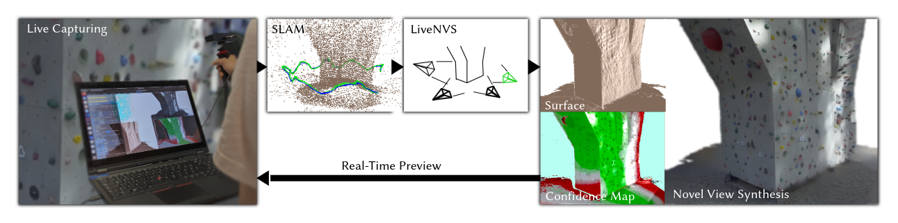

# LiveNVS 

Official repository of the paper "LiveNVS".



## Prerequisites

### System (tested)
* Ubuntu 20.04/22.04
* gcc/++ >= 11 ( & g++-9 for cuda?)
* cuda-11.6 capable system
* Conda installed and initialized
* ~20GB of free space

### Packages
```
sudo apt install -y build-essential libx11-dev xorg-dev libopengl-dev freeglut3-dev cmake
sudo apt install -y libassimp-dev # optional, to reduce compile times
```

## Setup

Configure environment. The script will create a conda environment "torchgl" (including cuda-11.6 and cudnn) and download libtorch.
```
chmod +x ./configure.sh
./configure.sh
```

## Run

In run.sh, check the set compiler versions and adapt to you system if neccessary. 

```
chmod +x ./run.sh
./run.sh
```

## (Optional) VSCode config
See the exemplary ```settings.json``` and ```launch.json``` in ```./example_vscode_files```. Use  ```vsc_env_init.sh``` to start vs code with the torchgl env activated and other environment variables set.


## Usage

* F2: Use free view point camera
    * Camera controls: w,a,s,d,q,e,r,f
    * Scroll wheel for cam speed
* F3: Use dataset camera (Active on launch)
    * Left and right arrow keys to move along trajectory

* F1: GUI
    * "Draw Auxiliaries" shows confidence map and shaded depth map
    * "Show SVG Menu" will show currently used views, the upmost checkbox "Draw Selected Frusta" addiationally draws their tiny frusta in the scene 
    * "Render Mode" to switch between neural and non-neural mode / forward and deferred warping mode
    * Using more "Num Views" than "Cache Size" available will cause undefined behavior
  
## Citation

TODO

## TODOs

- [] Add some gifs to the readme
- [] Add citation and link to paper
- [] Fix use of frustum culling results
- [] Provide resolution independent network trace